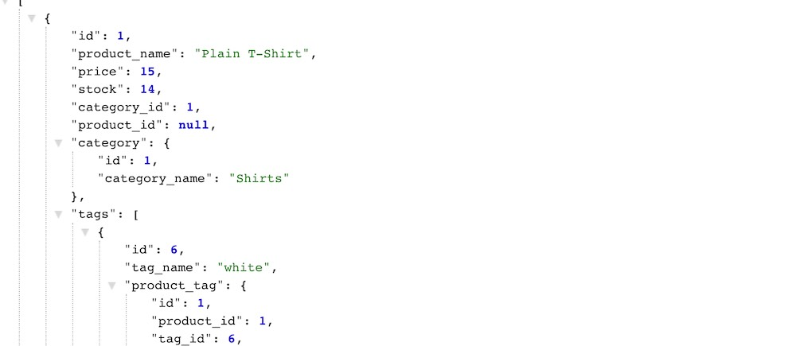

  
  
  # E-Commerce Back End

  ## Your Task

  Internet retail, also known as **e-commerce**, is the largest sector of the electronics industry, generating an estimated $29 trillion in 2019. E-commerce platforms like Shopify and WooCommerce provide a suite of services to businesses of all sizes. Due to their prevalence, understanding the fundamental architecture of these platforms will benefit you as a full-stack web developer.

  Your task is to build the back end for an e-commerce site by modifying starter code. You’ll configure a working Express.js API to use Sequelize to interact with a MySQL database.

  Because this application won’t be deployed, you’ll also need to provide a link to a walkthrough video that demonstrates its functionality and all of the acceptance criteria being met. You’ll need to submit a link to the video and add it to the readme of your project.
  ## Description
  Create an E-Commerce Back End to use API calls to manage products, tags, categories.
  
  ## Table of Contents
  - [Installation](#installation)
  - [Usage](#usage)
  - [Contributing](#contributing)
  - [License](#license)
  - [Questions](#questions)
  ## Installation
  npm i
  ## Usage
  npm start

  ## Testing
  npm run lint
  ## Contributing
  Open Source
  
  
  ## License
  This project is protected under MIT License.

[License Documentation](https://opensource.org/licenses/MIT)
  ## Questions
  [Refer to Github Profile: tallen1985](http://www.github.com/tallen1985)
  
  Any additional questions, reach me at my email jake.allen@me.com

  ## Performance / Links
  [Performance Link](https://watch.screencastify.com/v/WfPoKfWJtRiI2LsLfQyc)
  
  [Github Repo Link](https://github.com/tallen1985/13-E-Commerce-Back-End)

  
  